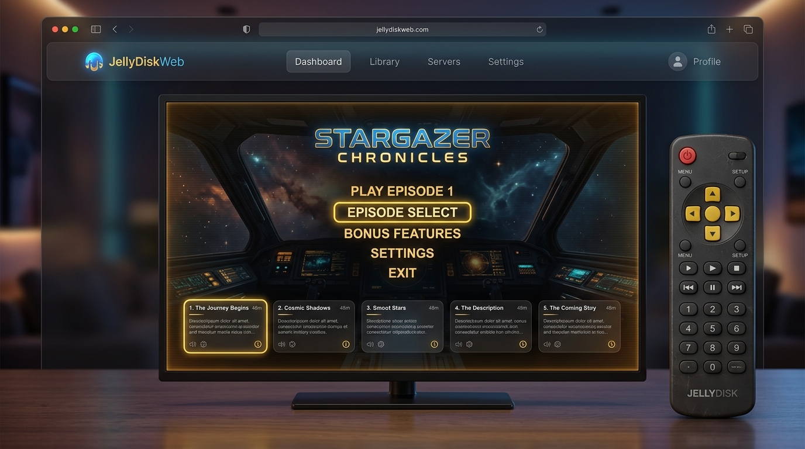

# JellyDiskWeb

An interactive, client-side web application that emulates the exact interface and nostalgia of physical DVD ISOs generated by JellyDisk, streaming directly from your Jellyfin server.



---

## Features

- **📺 Authentic 16:9 NTSC Interface**: Emulates the exact visual layout of physical DVD ISOs, complete with dimming blends, widescreen aspect ratios, and custom typography.
- **🎛️ Virtual Retro Remote Control**: Includes a styled, clickable remote control on screen with a working D-Pad (Up, Down, Left, Right, Enter), returning menus, subtitle controls, play/pause, and power.
- **🎹 Web Audio Synthesizer**: Uses custom, zero-asset client-side oscillators to generate nostalgic navigation clicks, selection chimes, correct trivia cues, and incorrect answer buzzers.
- **⌨️ Physical Keyboard Mapping**: Allows full hands-free navigation of all menus using arrow keys, Enter (Select), and Backspace/Escape (Return), exactly like playing a DVD on a hardware player.
- **📻 Theme Song Looping**: Fetches and loops the show's theme music directly from your Jellyfin server while browsing the menus, stopping automatically during video streaming.
- **❓ Dynamic DVD Trivia Game**: Replicates the Python suite's trivia compiler, dynamically generating up to 20 multiple-choice questions from Jellyfin actor, director, writer, release year, and episode metadata.
- **👾 CRT Scanline Filters**: Toggleable retro scanline raster overlays, vignette shadows, and CRT screen bulge/flicker animations to recreate the late-90s television vibe.
- **🎬 Soft Subtitle Toggling**: Turn subtitle track visibility on/off directly from the virtual remote or the Subtitles Setup menu.

---

## Setup & Running

### Prerequisites
- [Node.js](https://nodejs.org/) (v18+)
- [npm](https://www.npmjs.com/)

### Installation

1. Enter the directory:
   ```bash
   cd JellyDiskWeb
   ```

2. Install dependencies:
   ```bash
   npm install
   ```

### Development Testing

You can connect to any Jellyfin server directly from the login screen. For rapid development, you can create a local git-ignored configuration to prefill your credentials.

Create a file named `.env.local` in the `JellyDiskWeb` directory:
```env
VITE_JELLYFIN_URL=https://your-jellyfin-url.com
VITE_JELLYFIN_USER=username
VITE_JELLYFIN_PASS=password
```

Start the development server:
```bash
npm run dev
```

### Production Build

Build the static site:
```bash
npm run build
```

This compiles a single, lightweight HTML/CSS/JS client-side bundle in the `dist/` directory. You can host this folder on any static web server (GitHub Pages, Cloudflare Pages, Netlify, Nginx, or directly inside a Jellyfin custom page block).
