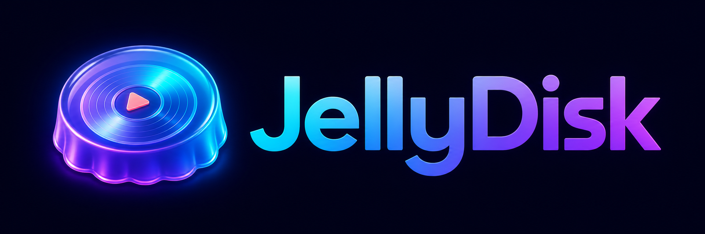

<p align="center">
  
</p>

<p align="center">
  Make DVDs from a Jellyfin library.
</p>

<p align="center">
  <a href="https://github.com/DrewThomasson/JellyDisk/releases/latest"></a>
  <a href="LICENSE"></a>
  
  
</p>

JellyDisk is a desktop app and command-line tool for turning movies and TV
seasons from a Jellyfin server into DVD ISOs. It handles the transcoding,
menus, subtitles, disc splitting, and printable case artwork.

> [!TIP]
> To try the menus without authoring an ISO, use the
> [JellyDisk Web Interface](JellyDiskWeb/README.md).

## Screenshots

<table>
  <tr>
    <td width="50%"></td>
    <td width="50%"></td>
  </tr>
  <tr>
    <td width="50%"></td>
    <td width="50%"></td>
  </tr>
</table>

Sample print files:
[episode guide](https://github.com/user-attachments/files/29831463/Smiling.Friends_Season.1_Episode_Guide.pdf)
· [disc label](https://github.com/user-attachments/files/29831461/Smiling.Friends_Season.1_Disc_1_Label.pdf)
· [DVD cover](https://github.com/user-attachments/files/29831462/Smiling.Friends_Season.1_DVD_Cover.pdf)

## Features

- Browse shows, movies, and seasons from Jellyfin.
- Inspect the case, booklet, and disc before starting a build.
- Try the finished menu layout, navigation, music, trivia, and episode links.
- Create episode menus, cast pages, subtitle controls, and optional trivia.
- Fit a season to DVD-5 or DVD-9 and split it across discs when needed.
- Export an ISO or burn directly on supported systems.
- Generate a case wrap, episode booklet, and disc label at 300 DPI.
- Run from the desktop app, the CLI, or Docker.

## Quick start

```bash
git clone https://github.com/DrewThomasson/JellyDisk.git
cd JellyDisk

python -m venv .venv
source .venv/bin/activate  # Windows: .venv\Scripts\activate
pip install -r requirements.txt

python -m jellydisc.main
```

You will also need `ffmpeg`, `dvdauthor`, and `spumux`. Platform-specific
installation commands are below.

## Requirements

### Python

- Python 3.12+

### System Dependencies

- `ffmpeg` - Media transcoding. **Note:** If you want subtitle support, your `ffmpeg` binary must be compiled with `--enable-libass` (which is included by default in standard packages installed via Ubuntu `apt` or macOS `brew`, but may be missing in minimal or custom builds like Linuxbrew's default recipe).
- `dvdauthor` - DVD structure creation
- `spumux` (part of dvdauthor) - Subtitle and interactive highlight rendering

### Optional (for burning)

- **Windows**: ImgBurn
- **Linux**: growisofs / dvd+rw-format / wodim
- **Mac**: hdiutil (built-in) / drutil (built-in)

## Installation

1. Clone the repository:

```bash
git clone https://github.com/DrewThomasson/JellyDisk.git
cd JellyDisk
```

2. Create a virtual environment and install dependencies:

```bash
python -m venv .venv
source .venv/bin/activate  # Windows: .venv\Scripts\activate
pip install -r requirements.txt
```

3. Install system dependencies:

**Ubuntu/Debian**

```bash
sudo apt install ffmpeg dvdauthor dvd+rw-tools wodim yt-dlp
```

**macOS (Homebrew)**

```bash
brew install ffmpeg dvdauthor yt-dlp
```

**Windows**

Download [FFmpeg](https://ffmpeg.org/download.html), `dvdauthor` from an
available Windows port, and optionally
[yt-dlp](https://github.com/yt-dlp/yt-dlp) for remote YouTube trailers.

## Usage

### Running the Desktop Application

Make sure your virtual environment is active, then launch the main GUI application:

```bash
python -m jellydisc.main
```

### Running in Headless CLI Mode

JellyDisk can run completely headless from the command line, making it suitable
for Unraid, TrueNAS, and other home servers.

To view all command line options and arguments:

```bash
python -m jellydisc.main --help
```

#### Automate DVD Creation

To fetch, transcode, build DVD menus, generate ISOs, and print cover art in a single command:

```bash
python -m jellydisc.main --headless \
  --server "https://yourjellyfin.com" \
  --username "User" \
  --password "Password" \
  --show "Smiling Friends" \
  --season "Season 1"
```

#### Automate Erasing and Burning

To automatically erase a rewritable disc (`DVD-RW` / `CD-RW`) and burn the resulting ISOs directly to a specific burner:

```bash
python -m jellydisc.main --headless \
  --server "https://yourjellyfin.com" \
  --username "User" \
  --password "Password" \
  --show "Smiling Friends" \
  --season "Season 1" \
  --erase \
  --burn \
  --drive "/dev/rdisk4" \
  --speed 4
```

#### Standalone Disc Utilities

- **List detected optical drives:**

  ```bash
  python -m jellydisc.main --list-drives
  ```

- **Erase/format a rewritable disc:**

  ```bash
  python -m jellydisc.main --erase --drive "/dev/rdisk4"
  ```

### Running via Docker (Compose)

JellyDisk includes a guided interactive terminal wizard, so Docker users can
author DVDs without installing Python, FFmpeg, or `dvdauthor` on the host.

#### 1. Setup Environment Credentials (Optional)

To avoid typing your credentials, create a `.env` file in the root directory:

```env
JELLYFIN_URL=https://your-jellyfin-server.com
JELLYFIN_USER=your_username
JELLYFIN_PASS=your_password
```

#### 2. Run the Interactive Wizard

Simply execute the container:

```bash
docker compose run --rm jellydisc
```
This will start the interactive setup wizard inside your terminal, prompting you to search for a media title, choose a season, configure subtitles, and select options.

#### 3. Run directly with CLI Flags

If you want to run it headlessly without the interactive prompts, supply standard CLI flags:

```bash
docker compose run --rm jellydisc --show "Smiling Friends" --season "2"
```

#### 4. Burning to Physical Discs (Linux/Ubuntu only)

Uncomment the `devices` configuration in your `docker-compose.yml` file to expose `/dev/sr0` to the container, then run:

```bash
docker compose run --rm jellydisc --show "Smiling Friends" --season "2" --burn --drive "/dev/sr0"
```
> [!NOTE]
> Docker Desktop for macOS and Windows does not support optical-drive device
> passthrough. Build the ISO in Docker and burn it from the host instead.

### Project Structure

```
JellyDisc/
├── assets/          # Downloaded images and theme songs
├── staging/         # Temporary transcoded MPEG files and DVD author folders
├── output/          # Final DVD ISO files
├── jellydisc/       # Main package
│   ├── __init__.py
│   ├── main.py      # CustomTkinter GUI & Authoring pipeline
│   ├── burner.py    # Cross-platform disc burner & eraser
│   ├── transcoder.py# FFmpeg wrapper and bitrate manager
│   ├── menu_builder.py # Menu image and spumux generator
│   └── jellyfin_client.py # Connection client
├── requirements.txt
└── README.md
```

## Printing Guidelines

All generated artwork PDFs are configured at high-resolution **300 DPI** to match standard optical media packaging sizes exactly:

- **DVD Cover Wrap:** 273mm x 183mm (Fits standard 14mm spine DVD cases).
- **Episode Booklet:** 120mm x 180mm (Fits booklet clips inside standard DVD cases).
- **Disc Label:** 118mm x 118mm (Standard printable CD/DVD disc face size).

> [!IMPORTANT]
> When printing the generated PDFs, you **must** configure your printer settings as follows:
> - Set **Page Scaling / Scale** to **"Actual Size"** or **"100%"**.
> - Do **not** select *"Fit to Page"*, *"Scale to Fit"*, or *"Shrink to Fit"*, as this will stretch the images to fill the entire sheet of paper, making them too large to fit in your DVD cases.

## License

Apache License 2.0 - See [LICENSE](LICENSE) for details.
